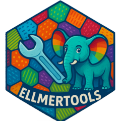

<!-- README.md is generated from README.Rmd. Please edit that file -->

```{r, include = FALSE}
knitr::opts_chunk$set(
  collapse = TRUE,
  comment = "#>",
  fig.path = "man/figures/README-",
  out.width = "100%",
  tidy.opts = list(width.cutoff = 80)
)
```

# ellmertools 

<!-- badges: start -->
<!-- badges: end -->

The goal of ellmertools is to provide a set of useful tool functions that you can easily register with [ellmer](https://ellmer.tidyverse.org/). Tools are functions that can be called by a chat model to perform specific tasks, such as fetching data or performing calculations. This package provides a set of general tools that can be registered with ellmer to enhance the capabilities of your chat model.

Here's a great explanation of tool calling from the [ellmer vignette](https://ellmer.tidyverse.org/articles/tool-calling.html) that goes into more detail about how tool calling works. I encourage you to read [the vignette](https://ellmer.tidyverse.org/articles/tool-calling.html) to understand how to use tools in ellmer.

> "When making a chat request to the chat model, the caller advertises one or more tools (defined by their function name, description, and a list of expected arguments), and the chat model can choose to respond with one or more “tool calls”. These tool calls are requests from the chat model to the caller to execute the function with the given arguments; the caller is expected to execute the functions and “return” the results by submitting another chat request with the conversation so far, plus the results. The chat model can then use those results in formulating its response, or, it may decide to make additional tool calls... Note that the chat model does not directly execute any external tools! It only makes requests for the caller to execute them."

## Installation

You can install the development version of ellmertools from [GitHub](https://github.com/) with:

``` r
# install.packages("devtools")
devtools::install_github("parmsam/ellmertools")
```

## Example

This is a basic example which shows you how to solve a common problem:

```{r example}
#| warning: FALSE
library(ellmertools)
library(ellmer)
```

### Get weather forecast

```{r get-weather}
#| eval: FALSE
chat <- chat_openai(model = "gpt-4o-mini")
chat$register_tool(tool_get_current_forecast)
chat$chat("Give me a weather update for Chicago for tonight. What should I wear?")
#> For tonight in Chicago, the forecast is partly cloudy with a temperature around 
#> 54°F. There is no expected rain, so you should dress comfortably.
#> 
#> ### Suggested Outfit:
#> - A light jacket or sweater to keep warm in the cooler evening temperatures.
#> - Comfortable pants or jeans.
#> - A light scarf might be nice if you tend to get chilly in the evening. 
#> 
#> Enjoy your evening!
```

### Get temperature

```{r get-temperature}
#| eval: FALSE
chat <- chat_openai(model = "gpt-4o-mini")
chat$register_tool(tool_get_current_temperature)
chat$chat("What is the current temperature in New York City in Fahrenheit?")
#> The current temperature in New York City is approximately 19.1°C, which is  about 66.4°F.
```

### Get date/time

```{r get-current-time}
#| eval: FALSE
chat <- chat_openai(model = "gpt-4o-mini")
chat$register_tool(tool_get_current_time)
chat$chat("What time is in New York right now? I need to know the current time.")
#> The current time in New York is 12:03 PM EDT on  June 1, 2025.
chat$chat("What day is it?")
#> Today is June 1, 2025.
```

### Get location

```{r get-current-location}
#| eval: FALSE
chat <- chat_openai(model = "gpt-4o-mini")
chat$register_tool(tool_get_current_location)
chat$chat("Where am I right now? What is my approximate location?")
#> Your approximate location is Beverly Hills, California, USA. The postal code is 90210, and you are in the America/Los_Angeles time zone.
```

### Get working directory structure and contents

```{r get-current-wd}
#| eval: FALSE
old_wd <- getwd()
temp_dir <- tempdir()
setwd(temp_dir)
# add example files into the temporary directory
writeLines(c("This is a test file."), file.path(temp_dir, "test1.txt"))
writeLines(c("This is another test file."), file.path(temp_dir, "test2.txt"))
chat <- chat_openai(model = "gpt-4o-mini")
chat$register_tool(tool_get_current_wd)
chat$chat("What's in my current working directory? Can you list the files in it?")
setwd(old_wd)
#> Your current working directory contains the following files:
#> 
#> 1. **test1.txt**: This file contains the text "This is a test file."
#> 2. **test2.txt**: This file contains the text "This is another test file."
```

### Bookmarking

```{r}
#| eval: FALSE
old_wd <- getwd()
temp_dir <- tempdir()
setwd(temp_dir)

bookmark_save("person_name", "Sam")
chat <- chat_openai(model = "gpt-4o-mini")

chat$register_tool(tool_bookmark_save)
chat$register_tool(tool_bookmark_list)
chat$register_tool(tool_bookmark_read)

chat$chat("Give me give 5 random names and bookmark them in a list called random_names.")
#> I've generated and bookmarked a list of random names under the bookmark "random_names". Here they are:
#> 
#> 1. Avery
#> 2. Mason
#> 3. Harper
#> 4. Logan
#> 5. Skylar
#> 
#> If you need anything else, just let me know!
chat$chat("Please list my bookmarks.")
#> Here are your bookmarks:                                       
#> 
#> 1. person_name
#> 2. random_names
#> 
#> Let me know if you need further assistance!
chat$chat("Please read the person_name bookmark. What does it say?")
#> The "person_name" bookmark contains the name: **Sam**. If you need anything else, feel free to ask!
bookmark_list()
#> [1] "person_name"  "random_names"
bookmark_read("random_names")
#> [1] "1. Avery\n2. Mason\n3. Harper\n4. Logan\n5. Skylar"
setwd(old_wd)
```

### Extract R code chunks

```{r extract-r-code-chunks}
#| eval: FALSE
chat <- chat_openai(model = "gpt-4o-mini")
md_response <- chat$chat("Give me a short markdown based example that shows how plot a scatter plot in R using ggplot2. Please use R code chunks.")
cat(extract_r_code_chunks(md_response))
#> # Load the ggplot2 package
#> library(ggplot2)
#> 
#> # Create a scatter plot using the mtcars dataset
#> ggplot(data = mtcars, aes(x = wt, y = mpg)) +
#>   geom_point(color = "blue", size = 3) +
#>   labs(title = "Scatter Plot of Weight vs MPG",
#>        x = "Weight (1000 lbs)",
#>        y = "Miles Per Gallon (MPG)") +
#>   theme_minimal()
```

### Run R code

```{r run-r-code}
#| eval: FALSE
chat <- chat_openai(model = "gpt-4o-mini")
chat$register_tool(tool_run_r_code)
chat$chat("Run this R code: mean(1:50)")
#> The result of the R code `mean(1:50)` is **25.5**.
```

### Call a mini chat

```{r call-mini-chat}
#| eval: FALSE
chat <- chat_openai(model = "gpt-4o-mini")
chat$register_tool(tool_call_mini_chat)
chat$chat("Use the `tool_call_mini_chat` tool to answer this question. What is the capital of France?")
#> Using the tool, the capital of France is confirmed to be Paris.
```
