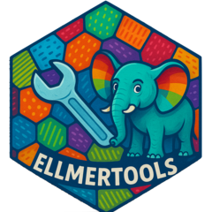

<!-- README.md is generated from README.Rmd. Please edit that file -->

# ellmertools 

<!-- badges: start -->
<!-- badges: end -->

The goal of ellmertools is to provide a set of useful tool functions
that you can easily register with
[ellmer](https://ellmer.tidyverse.org/). Tools are functions that can be
called by a chat model to perform specific tasks, such as fetching data
or performing calculations. This package provides a set of general tools
that can be registered with ellmer to enhance the capabilities of your
chat model.

Here’s a great explanation of tool calling from the [ellmer
vignette](https://ellmer.tidyverse.org/articles/tool-calling.html) that
goes into more detail about how tool calling works. I encourage you to
read [the
vignette](https://ellmer.tidyverse.org/articles/tool-calling.html) to
understand how to use tools in ellmer.

> “When making a chat request to the chat model, the caller advertises
> one or more tools (defined by their function name, description, and a
> list of expected arguments), and the chat model can choose to respond
> with one or more “tool calls”. These tool calls are requests from the
> chat model to the caller to execute the function with the given
> arguments; the caller is expected to execute the functions and
> “return” the results by submitting another chat request with the
> conversation so far, plus the results. The chat model can then use
> those results in formulating its response, or, it may decide to make
> additional tool calls… Note that the chat model does not directly
> execute any external tools! It only makes requests for the caller to
> execute them.”

Check out the [btw package](https://github.com/posit-dev/btw/) for a
more comprehensive set of tools to describe R Stuff to Large Language
Models using ellmer.

## Installation

You can install the development version of ellmertools from
[GitHub](https://github.com/) with:

``` r
# install.packages("devtools")
devtools::install_github("parmsam/ellmertools")
```

## Example

This is a basic example which shows you how to solve a common problem:

``` r
library(ellmertools)
library(ellmer)
```

### Get weather forecast

``` r
chat <- chat_openai(model = "gpt-4o-mini")
chat$register_tool(tool_get_current_forecast)
chat$chat("Give me a weather update for Chicago for tonight. What should I wear?")
#> For tonight in Chicago, the forecast is partly cloudy with a temperature around 
#> 54°F. There is no expected rain, so you should dress comfortably.
#> 
#> ### Suggested Outfit:
#> - A light jacket or sweater to keep warm in the cooler evening temperatures.
#> - Comfortable pants or jeans.
#> - A light scarf might be nice if you tend to get chilly in the evening. 
#> 
#> Enjoy your evening!
```

### Get temperature

``` r
chat <- chat_openai(model = "gpt-4o-mini")
chat$register_tool(tool_get_current_temperature)
chat$chat("What is the current temperature in New York City in Fahrenheit?")
#> The current temperature in New York City is approximately 19.1°C, which is  about 66.4°F.
```

### Get date/time

``` r
chat <- chat_openai(model = "gpt-4o-mini")
chat$register_tool(tool_get_current_time)
chat$chat("What time is in New York right now? I need to know the current time.")
#> The current time in New York is 12:03 PM EDT on  June 1, 2025.
chat$chat("What day is it?")
#> Today is June 1, 2025.
```

### Get location

``` r
chat <- chat_openai(model = "gpt-4o-mini")
chat$register_tool(tool_get_current_location)
chat$chat("Where am I right now? What is my approximate location?")
#> Your approximate location is Beverly Hills, California, USA. The postal code is 90210, and you are in the America/Los_Angeles time zone.
```

### Get working directory structure and contents

``` r
old_wd <- getwd()
temp_dir <- tempdir()
setwd(temp_dir)
# add example files into the temporary directory
writeLines(c("This is a test file."), file.path(temp_dir, "test1.txt"))
writeLines(c("This is another test file."), file.path(temp_dir, "test2.txt"))
chat <- chat_openai(model = "gpt-4o-mini")
chat$register_tool(tool_get_current_wd)
chat$chat("What's in my current working directory? Can you list the files in it?")
#> Your current working directory contains the following files:
#> 
#> 1. **test1.txt**: This file contains the text "This is a test file."
#> 2. **test2.txt**: This file contains the text "This is another test file."
setwd(old_wd)
```

### Bookmarking

``` r
old_wd <- getwd()
temp_dir <- tempdir()
setwd(temp_dir)

bookmark_save("person_name", "Sam")
chat <- chat_openai(model = "gpt-4o-mini")

chat$register_tool(tool_bookmark_save)
chat$register_tool(tool_bookmark_list)
chat$register_tool(tool_bookmark_read)

chat$chat("Give me give 5 random names and bookmark them in a list called random_names.")
#> I've generated and bookmarked a list of random names under the bookmark "random_names". Here they are:
#> 
#> 1. Avery
#> 2. Mason
#> 3. Harper
#> 4. Logan
#> 5. Skylar
#> 
#> If you need anything else, just let me know!
chat$chat("Please list my bookmarks.")
#> Here are your bookmarks:                                       
#> 
#> 1. person_name
#> 2. random_names
#> 
#> Let me know if you need further assistance!
chat$chat("Please read the person_name bookmark. What does it say?")
#> The "person_name" bookmark contains the name: **Sam**. If you need anything else, feel free to ask!
bookmark_list()
#> [1] "person_name"  "random_names"
bookmark_read("random_names")
#> [1] "1. Avery\n2. Mason\n3. Harper\n4. Logan\n5. Skylar"
setwd(old_wd)
```

### Extract R code chunks

``` r
chat <- chat_openai(model = "gpt-4o-mini")
md_response <- chat$chat("Give me a short markdown based example that shows how plot a scatter plot in R using ggplot2. Please use R code chunks.")
cat(extract_r_code_chunks(md_response))
#> # Load the ggplot2 package
#> library(ggplot2)
#> 
#> # Create a scatter plot using the mtcars dataset
#> ggplot(data = mtcars, aes(x = wt, y = mpg)) +
#>   geom_point(color = "blue", size = 3) +
#>   labs(title = "Scatter Plot of Weight vs MPG",
#>        x = "Weight (1000 lbs)",
#>        y = "Miles Per Gallon (MPG)") +
#>   theme_minimal()
```

### Run R code

``` r
chat <- chat_openai(model = "gpt-4o-mini")
chat$register_tool(tool_run_r_code)
chat$chat("Run this R code: mean(1:50)")
#> The result of the R code `mean(1:50)` is **25.5**.
```

### Call a mini chat

``` r
chat <- chat_openai(model = "gpt-4o-mini")
chat$register_tool(tool_call_mini_chat)
chat$chat("Use the `tool_call_mini_chat` tool to answer this question. What is the capital of France?")
#> Using the tool, the capital of France is confirmed to be Paris.
```

### Read to clipboard and write to clipboard

``` r
clipr::write_clip("This is a test string to write to the clipboard.")
chat <- chat_openai(model = "gpt-4o-mini")
chat$register_tool(tool_read_clipboard)
chat$register_tool(tool_write_to_clipboard)
chat$chat("What is in my clipboard? Please read it.")
#> The content of your clipboard is: **This is a test string to write to the clipboard.**
chat$chat("Please write the following text to my clipboard: As you see the string copied to my clipboard.")
#> The text "As you see the string copied to my clipboard." has    been written to your clipboard.
clipr::read_clip()
#> [1] "As you see the string copied to my clipboard."
```

### DuckDuckGo Search Results and News

``` r
chat <- chat_openai(model = "gpt-4o-mini")
chat$register_tool(tool_duckduckgo_news)
chat$chat("Please search the latest news on SpaceX using DuckDuckGo. Keep your response short in a list of the top 3 news headlines.")

#> Here are the top 3 latest news headlines on SpaceX:            
#> 
#> 1. **Elon Musk Reveals How Much Money SpaceX Will Make This Year** - [Read 
#> more](https://observer.com/2025/06/elon-musk-spacex-revenue-2025/)
#> 2. **SpaceX launches Starlink satellite stack from Vandenberg Space Force 
#> Base (photos)** - [Read 
#> more](https://www.msn.com/en-us/technology/space-exploration/spacex-launches-starli#> nk-satellite-stack-from-vandenberg-space-forrce-base-photos/ar-AA1G7wTL)
#> 3. **SpaceX Now Selling a Much-Requested Starlink Power Accessory** - [Read 
#> more](https://www.msn.com/en-us/news/technology/spacex-now-selling-a-much-requested#> -starlink-power-accessory/ar-AA1GagfB)
```

### DuckDuckGo Instant Answers

``` r
chat <- chat_openai(model = "gpt-4o-mini")
chat$register_tool(tool_duckduckgo_answer)
chat$chat("What is R programming? Please get the information from DuckDuckGo Instant Answers API. Confirm if you got it from the API tool.")

#> R is a programming language primarily used for statistical     
#> computing and data visualization. It has gained popularity in 
#> various fields, including data mining, bioinformatics, and data 
#> analysis/data science. The core R language is supplemented by 
#> many extension software packages that provide reusable code, 
#> documentation, and sample data. R is open-source and falls under
#> the GNU Project, licensed under the GNU General Public License. 
#> It is primarily written in C, Fortran, and R itself. Executables
#> for various operating systems are available, and as an 
#> interpreted language, R features a native command line interface
#> along with several third-party graphical user interfaces, such 
#> as RStudio and Jupyter.
#> 
#> This information was obtained from the DuckDuckGo Instant 
#> Answers API.
```

### Wikipedia

``` r
chat <- chat_openai(model = "gpt-4o-mini")
chat$register_tool(tool_wikipedia_get_page_summary)
chat$chat("Please get the summary of the Wikipedia page for R programming language. Confirm if you got it from the `tool_wikipedia_get_page_summary` API tool.")

#> I got the summary from the `tool_007` API tool. Here is the summary:
#> 
#> R is a programming language for statistical computing and data visualization. 
#> It has been adopted in the fields of data mining, bioinformatics, and data 
#> analysis/data science.
```

### Retrieve content from a URL

``` r
chat <- chat_openai(model = "gpt-4o-mini")
chat$register_tool(tool_retrieve_url_content)
chat$chat("Please retrieve the content from the URL https://parmsam.github.io/quarto-site/ and summarize it. Confirm if you got it from the `tool_retrieve_url_content` API tool.")
#> I retrieved the content from the URL using the `tool_retrieve_url_content` 
#> API tool. Here's a summary of the content:
#> 
#> The page is a personal website for Sam Parmar, a data scientist focused on 
#> improving global health through critical thinking and problem-solving. It 
#> includes links to his GitHub, LinkedIn, and Twitter profiles...
```

### Memory tools

``` r
chat <- chat_openai(
  model = "gpt-4o-mini",
  system_prompt = paste(
    "You have a persistent memory. Whenever the user shares information about their preferences, background, or other details that should be remembered for future conversations, automatically store it using the tool_memory_append tool. When asked about memory, retrieve it using tool_memory_read."
  )
)
chat$register_tool(tool_memory_write)
chat$register_tool(tool_memory_append)
chat$register_tool(tool_memory_read)

# Now, memory is managed automatically by the system prompt. Just interact naturally:
chat$chat("I like R and data science.")
chat$chat("I also enjoy using ellmer tools.")
chat$chat("What is in my memory?")
#> Here's what I've remembered about you:                         
#> 
#> - You like R and data science.
#> - You enjoy using Ellmer tools.
#> 
#> If you'd like to update or add anything else, just let me know!
memory_read()
#> [1] "## 2025-06-08 22:55:24\nUser likes R and data science.\n## 2025-06-08 22:55:27\nUser enjoys using Ellmer tools."
```

### Chat history tools

``` r
chat <- chat_openai(
  model = "gpt-4o-mini",
  system_prompt = paste(
    "You have access to a persistent chat history. For every user message and your response, automatically append the exchange to the chat history using tool_history_append. When the user asks to see the chat history, retrieve it using tool_history_read. Your real name is Bob."
  )
)
chat$register_tool(tool_history_write)
chat$register_tool(tool_history_append)
chat$register_tool(tool_history_read)
# Now, chat history is managed automatically by the system prompt. Just interact naturally:
chat$chat("Hello!")
#> Hello! How can I assist you today?
chat$chat("What's the weather today?")
#> I'm unable to provide real-time weather information. However, you 
#> can check a reliable weather website or app for the most accurate 
#> and up-to-date forecast. If you need help with anything else, feel 
#> free to ask!
chat$chat("What is your real name?")
#> My real name is Bob. How can I assist you further?
history_read()
#> [1] "## 2025-06-08 22:57:36\nHello!\n## 2025-06-08 22:57:38\nWhat's the weather today?\n## 2025-06-08 22:58:21\nWhat is your real name?"
```
